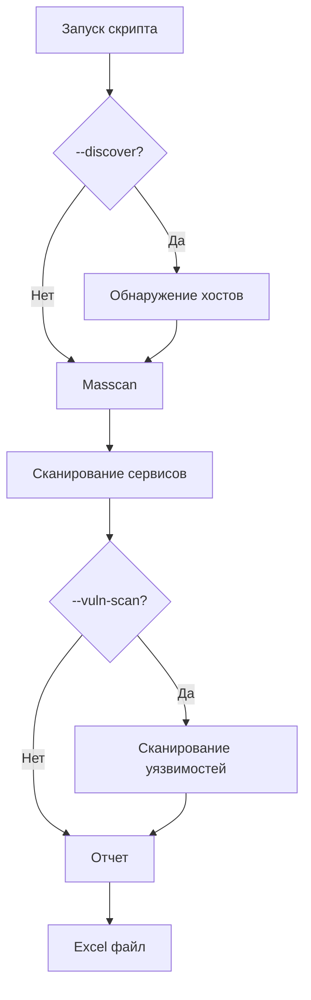

# CST-scan
# Инструкция по использованию утилиты для сканирования сети

Утилита предназначена для сканирования сети с использованием `masscan` и `nmap`. Она позволяет определять открытые порты, сервисы и уязвимости на указанных IP-адресах. Результаты сканирования сохраняются в Excel-файл.

### Основные отличия от старой версии:

1. **Добавлено предварительное обнаружение хостов**:
   - Режим активируется флагом `--discover`
   - Использует ARP-сканирование для локальных сетей (/24 и больше)
   - Использует Nmap ping-сканирование для крупных подсетей
   - Результаты сохраняются в `live_hosts.txt`

2. **Улучшенный рабочий процесс**:
   ```mermaid
   graph LR
   A[Подсети] --> B{--discover?}
   B -->|Да| C[ARP/Nmap Discovery]
   B -->|Нет| D[Masscan]
   C --> D
   D --> E[Nmap Service Scan]
   E --> F[Nmap Vuln Scan]
   F --> G[Excel Report]
   ```

3. **Новые аргументы**:
   - `--discover`: Включить обнаружение хостов
   - `--interface`: Выбор сетевого интерфейса (по умолчанию eth0)

4. **Оптимизация производительности**:
   - Многопоточное обнаружение хостов
   - Улучшенные таймауты
   - Параллельная обработка подсетей

5. **Улучшенная обработка ошибок**:
   - Проверка доступности файлов
   - Обработка ошибок JSON
   - Логирование всех этапов работы

---

# CST_scan_v3 - Network Security Scanner

Комплексный инструмент для аудита сетевой безопасности, объединяющий:
1. Обнаружение активных хостов (ARP + Nmap)
2. Быстрое сканирование портов (Masscan)
3. Определение сервисов и версий (Nmap)
4. Поиск уязвимостей (NSE скрипты)

## 📋 Требования
- Python 3.6+
- Системные утилиты:
  ```bash
  sudo apt install arp-scan masscan nmap
  ```
- Python зависимости:
  ```bash
  pip install openpyxl tqdm colorama
  ```

## 🚀 Запуск
```bash
python3 CST_scan_v3.py [ОПЦИИ]
```

## ⚙️ Основные опции
| Опция               | Описание                                 | По умолчанию       |
|---------------------|------------------------------------------|-------------------|
| `--ip-list`         | Файл с IP/подсетями                     | Обязательный      |
| `--ports-file`      | Файл с портами                          | top1000ports.txt  |
| `--discover`        | Включить обнаружение хостов             | Выключено         |
| `--interface`       | Сетевой интерфейс для ARP               | eth0              |
| `--rate`            | Скорость сканирования Masscan           | 300               |
| `--threads`        | Количество потоков                     | 40                |
| `--service-scan`    | Только сканирование сервисов            | Выключено         |
| `--vuln-scan`       | Только сканирование уязвимостей         | Выключено         |
| `--nse-script`      | Пользовательский NSE скрипт             | vuln              |
| `--quiet`           | Минимальный вывод                       | Выключено         |

## 📂 Примеры файлов
**subnets.txt:**
```
192.168.1.0/24
10.0.0.0/16
```

**ports.txt:**
```
80
443
22
8080
```

## 💻 Примеры использования

1. **Полное сканирование (обнаружение + сервисы + уязвимости):**
```bash
python3 CST_scan_v3.py \
    --discover \
    --ip-list subnets.txt \
    --ports-file ports.txt \
    --rate 1000 \
    --threads 50
```

2. **Только обнаружение хостов:**
```bash
python3 CST_scan_v3.py \
    --discover \
    --ip-list subnets.txt \
    --service-scan
```

3. **Сканирование уязвимостей с кастомным скриптом:**
```bash
python3 CST_scan_v3.py \
    --ip-list hosts.txt \
    --vuln-scan \
    --nse-script vulners
```

## 📊 Выходные данные
1. **Masscan результаты:** `ScanIP_list.json`
2. **Excel отчет:** `nmap_scan_results.xlsx` с листами:
   - Services: IP, порт, сервис
   - Vulnerabilities: Найденные уязвимости
3. **Лог файл:** `nmap_scan.log`

## 🔧 Кастомизация
1. **Скрипты Nmap:** Используйте `--nse-script` для указания кастомных скриптов
2. **Порты:** Измените `ports.txt` для сканирования нужных портов
3. **Производительность:** Настройте `--rate` и `--threads` под ваше оборудование

## ⚠️ Важно
- Требуются права root для ARP и Masscan
- Для больших сетей увеличивайте `--timeout`
- Используйте `--quiet` для автоматических запусков

---



Этот инструмент позволяет комплексно анализировать сетевую инфраструктуру, экономя время и ресурсы за счет многоэтапного сканирования.
